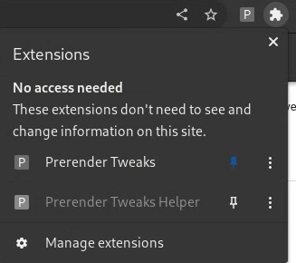
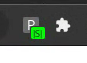
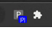

# Chrome Extensions: Prerender Tweaks

## Install
1. Open chrome://extensions/, and enable the developer mode.
2. Install both v2 and v3 directories from the "Load unpacked" button.
3. Pin the `Prerender Tweaks` from the Extensions menu.

## Indicators
### Speculationrules

The page contains a &lt;script type="speculationrules"&gt;.

### Prerendered(Activated)

The page wass prerendered and successfully activated.

### Injected

The page contains a &lt;script type="speculationrules"&gt; that is injected
by the Prerender Tweaks.

### Restored from the back-forward cache

The page was restored from the back-forward cache.

## Features
### Auto speculationrules injection
Prerender Tweaks inject a speculationrules if it doesn't exist in the page.
It will point the first appeared same-origin, different document anchor link.